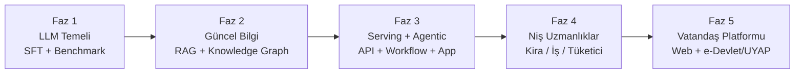

# HakHukuk — Vizyon Haritası

> **Misyon:** Adalete erişimi demokratikleştirmek. Vatandaşın yanında duran, hukuk dilini sadeleştiren, belge üreten ve kendi dosyasını anlamasına yardım eden açık bir yapay zeka asistanı.
>
> **Çerçeve (2026-05-29):** Repo şimdilik **private + proprietary** (ticari haklar sahibinde). Model kartı + ağırlıklar ileride HF'te yayınlanabilir (opsiyonel); akademik makale kapısı kapalı değil — bu yüzden tekrarlanabilirlik (sabit seed, loglu koşu, temiz ablation) baştan yerinde. Erişilebilirlik (consumer-grade donanımda çalışabilme) temel kısıt olduğundan model SLM-sınıfı tutulur — **seçilen baz: Gemma 4 12B** (`gemma-4-12B-it-qat-q4_0-unquantized`, QLoRA → Q4_0 GGUF ~6.5GB, Apache 2.0; güncellendi 2026-06-07).

---

## 1. Tasarım Prensipleri

| Prensip | Açıklama |
| :--- | :--- |
| **Erişilebilirlik > Devasa Performans** | Model, sıradan bir GPU'da (hatta CPU/edge) çalışabilmeli. Bu yüzden SLM. |
| **Kitle: Uzman (birincil) + Vatandaş (app-layer)** | **REVİZE (2026-06-13) → RESMİLEŞTİ (ADR-0010, Yürürlükte):** birincil kitle = **uzman (hukukçu)**; çıktı hassas + atıflı. Vatandaş sadeleştirmesi = **app-layer prompt modu**, model eğitim hedefi değil. Eski "default sade dil" ifadesi descoped — bkz `docs/adr/0010-reframe-birincil-register-uzman.md` + `docs/record/research_log.md` (2026-06-13). |
| **Güncellik Modelin Beyninde Değil, Kütüphanesinde** | Yasalar değişir; model değişmez. Güncellik RAG katmanında çözülür. |
| **Lisans-temiz & Tekrarlanabilir** | Sadece açık/kamu veri kaynakları (ticari kaynak yasak). Repo private/proprietary; ağırlıklar + model kartı ileride opsiyonel açılabilir. Seed/log/ablation baştan temiz. |
| **Genelden Nişe** | Önce genel hukuk yetkinliği, sonra dikey nişler (kira, iş, tüketici) için agentic workflow'lar. |

---

## 2. Evrim Haritası



### Faz 1 — LLM Temeli (Tez'in Çekirdeği)

**Hedef:** Türk hukuk diline ve akıl yürütmesine adapte olmuş, ölçülebilir bir baz model.

- **Baz model:** **Gemma 4 12B** (`google/gemma-4-12B-it-qat-q4_0-unquantized`, Apache 2.0) — QLoRA SFT → Q4_0 GGUF (~6.5GB) deploy; 8GB VRAM end-user hedef korunur. Encoder-free unified mimari — text-only SFT multimodal yeteneği bozmaz, gelecek fazlara hazır. (Kıyas adayları: Qwen3.5-4B, Gemma 4 E4B.)
- **Veri seti hazırlığı:** Otoriter/güncel plan **`docs/VERI_PLANI.md`**'de. Özet:
  - `OrionCAF/turkish_law_qa_dataset` + `Renicames/turkish-law-chatbot` (EDA-doğrulanmış, ~32K → `data/processed/sft_v0/`)
  - Mevzuat.gov.tr / Bedesten API açık kanun metinleri (grounding zemini)
  - Grounded sentetik üretim (gerçek madde → GPT-4o-mini → doğrula)
- **Fine-tuning:** QLoRA + Unsloth (Colab A100 / tek tüketici GPU).
- **Benchmark (kanıt seti):**
  - Avukatlık staj sınavı soruları
  - Hukuki terim → sade Türkçe çeviri doğruluğu
  - Muhakim (hukuk-native hakem) + GPT-4o/Gemini/Trendyol-LLM ile head-to-head.
- **Faz 1 bitti kriteri (REVİZE 2026-06-08/13, ADR-0001):** ana kapı = **groundedness** (FactScore+ALCE) + **abstention/Rejection-Rate** (TRAP). Muhakim+%15 ve göz-testi **descoped** (Muhakim ikincil/yanlı). Detay: `docs/record/research_log.md`.
- **Çıktı:** Fine-tuned + benchmarklı baz model (private). Model kartı + ağırlıklar ileride opsiyonel HF yayını; makale opsiyonel.

### Faz 2 — RAG + Knowledge Graph

> **Serving notu:** 256K context kullanımında KV-cache baskısı için **TurboQuant** (KV-cache quantization, 4.5×, eğitimsiz) değerlendirilir — bkz. `knowledge/summary_turboquant.md`.

**Hedef:** "Yeni yasa çıktı, ne yapacağız?" sorusunun mimari cevabı.

- **Neden Graph DB?** Hukuk doğası gereği ilişkiseldir:
  - Kanun → Madde → Fıkra hiyerarşisi
  - "Atıfta bulunulan madde", "yürürlükten kaldırılan madde", "ilgili Yargıtay kararı" gibi tipli ilişkiler
  - Düz vektör DB bu ilişkiyi kaybeder; **Neo4j / Memgraph + vektör hibrit** yapısı tasarlanır.
- **Pipeline:**
  1. Resmi Gazete / Mevzuat.gov.tr scraper (günlük)
  2. Yapı çıkarımı (madde, fıkra, atıf) → Graph
  3. Embedding katmanı (semantik arama)
  4. Hybrid retrieval: graph traversal + vektör benzerliği
- **Akademik katkı:** Hukuk metinleri için graph-RAG mimarisi karşılaştırması (vanilla RAG vs graph-RAG vs hybrid).

### Faz 3 — Model Serving + Agentic Workflow + App

> Agent altyapısı olmadan niş özellikler inşa edilemez — önce foundation kurulur.

**Serving:**
- Model serving (vLLM + GGUF → FastAPI REST endpoint)
- TurboQuant KV-cache entegrasyonu (256K context, 4.5× sıkıştırma)

**Agent + App — model artık asistan değil, iş bitirici:**
- **App stack (kilitlendi 2026-06-07):** Monorepo, Next.js 14 TS + FastAPI Python. **Avukat portalı önce**, vatandaş portalı sonraki iterasyon. Spec: `docs/superpowers/specs/2026-06-07-hakhukuk-web-app-design.md`
- Agent framework (LangGraph / custom) — referans: `github.com/willchen96/mike` (işlevsel)
- Tool entegrasyonu: TÜFE API, RAG sorgu, Bedesten canlı
- Dilekçe şablon sistemi (Arabuluculuk, Hakem Heyeti, itiraz)
- **Post-SFT RL altyapısı:** no-code UI ile hukukçu/kullanıcı feedback → DPO/RLHF döngüsü

**Multimodal Input (native Gemma 4 12B — model kartı teyitli):**
- Belge fotoğrafı / OCR: mahkeme kararı, sözleşme, tebligat → hukuki yorum (`visual_tokens=560-1120`)
- Sesli soru: yazamayan/okuyamayan vatandaşlar sesle sorar, model anlar

Örnek agent akışı:

```
Kullanıcı: [ses] "Ev sahibim kirayı %100 artırmak istiyor"
  ↓
[Audio] Model sesi anlar (native, text-only SFT'den etkilenmez)
  ↓
[Agent] Sözleşme tarihini sorar
  ↓
[Tool] TÜFE API → güncel oran çekilir
  ↓
[RAG/Graph] Güncel kira artış kuralı (TBK 344, varsa geçici madde) sorgulanır
  ↓
[Agent] Yasal sınır hesaplanır
  ↓
[Output] İtiraz dilekçesi taslağı + ödeme/tevdi yöntemi açıklaması
```

### Faz 4 — Niş Uzmanlıklar

> Faz 3'teki agent altyapısı üstüne domain-specific özellikler eklenir.

| Niş | Tipik kullanıcı sorusu | Çıktı |
| :--- | :--- | :--- |
| **Kira / Tahliye** | "Ev sahibi %100 zam istiyor" | TÜFE hesabı + itiraz dilekçesi taslağı |
| **İşçi Hakları** | "Mesai ücretim ödenmiyor" | Arabuluculuk başvuru taslağı + delil listesi |
| **Tüketici** | "Aldığım ürün ayıplı" | Hakem Heyeti dilekçesi + emsal kararlar |
| **KVKK** | "Aydınlatma metnim yeterli mi?" | Eksik unsur denetimi |

### Faz 5 — Vatandaş Platformu

- Web arayüzü (sade, mobil-öncelikli)
- e-Devlet / UYAP entegrasyonu (yargi-mcp veya muadili) — kullanıcının kendi dosyasını analiz
- e-Tebligat bildirim asistanlığı
- HITL döngüsü: gönüllü avukatlardan geri bildirim → DPO ile iyileştirme

---

## 3. Tez ve Makale Eksenleri

Bu yol haritası birden fazla yayınlanabilir çıktı üretir:

1. **Ana tez:** "Erişilebilir SLM'ler ile Türk Hukukunda Vatandaş Odaklı Yapay Zeka Asistanı"
2. **Yan makale 1:** Türk hukuku için açık benchmark seti (Faz 1 çıktısı)
3. **Yan makale 2:** Hukuk metinleri için Graph-RAG mimarisi (Faz 2 çıktısı)
4. **Yan makale 3:** Niş hukuk agent'ları için workflow değerlendirmesi (Faz 3-4)

---

## 4. Şu Anki Konum ve Sonraki Adım

- [x] Vizyon ve isim: **HakHukuk**
- [x] Faz sıralaması: LLM → RAG/Graph → Niş → Agent → Platform
- [x] ~~Faz 1 veri seti envanteri ve baz model seçimi (E2B vs E4B vs Phi-3.5)~~ → **TAMAMLANDI:** base = Gemma 4 12B (ADR-0003); veri envanteri `VERI_PLANI.md`; v0/v1 koştu.
- [ ] **Sonraki adım (2026-07-01):** **v2b SFT tam eğitimi** (Modal A100, `spawn_v2b --detach`) → canon eval. Detay: `NEXT_SESSION.md` + `docs/V2_PLAN.md §9`.
