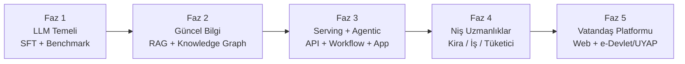

# HakHukuk — Vizyon Haritası

> **Misyon:** Adalete erişimi demokratikleştirmek. Vatandaşın yanında duran, hukuk dilini sadeleştiren, belge üreten ve kendi dosyasını anlamasına yardım eden açık bir yapay zeka asistanı.
>
> **⚠️⚠️ YENİ HAT (2026-07-24, ADR-0027).** Otorite tasarım belgesi artık **[`TASARIM.md`](../TASARIM.md)** (repo kökü) — ne inşa edeceğimiz ve neyi ölçeceğimiz orada. Gemma 4 12B hattı **emekli** (ADR-0024/0026; artefaktları 2026-07-28'de repo'dan silindi — **ADR-0034**, devir paketi `~/code/hukuk-devir/`): dersleri taşınır, **sayıları taşınmaz.** Aşağıdaki Faz haritası ve tasarım prensipleri geçerliliğini korur; base'e ve tur numaralarına yapılan atıflar **tarihsel iz** olarak okunur.
>
> **Tez artık iki katmanlı:** *dış* = maliyet-normalize parite (ADR-0017 teyit edildi) · *iç (YENİ)* = beceri başına bağımsız eğitilmiş LoRA kolları + task-vector merge, **çatışan becerileri** (grounding ↔ abstention) ardışık SFT'den daha iyi koruyor mu?
>
> **Çerçeve (2026-05-29):** Repo şimdilik **private + proprietary** (ticari haklar sahibinde). Model kartı + ağırlıklar ileride HF'te yayınlanabilir (opsiyonel); akademik makale kapısı kapalı değil — bu yüzden tekrarlanabilirlik (sabit seed, loglu koşu, temiz ablation) baştan yerinde. Erişilebilirlik (consumer-grade donanımda çalışabilme) temel kısıt olduğundan model SLM-sınıfı tutulur — ~~seçilen baz: Gemma 4 12B~~ → **base bir PARAMETRE** (ADR-0026); çalışma varsayımı ~4B sınıfı instruct model, 6 maddelik doğrulama kapısına bağlı (`TASARIM.md` §8).
>
> **⚠️ TEZ ÇERÇEVESİ (2026-07-17, otorite: `docs/superpowers/specs/2026-07-17-tez-cercevesi-design.md` + ADR-0017):** Tezin **birincil katkısı** artık tek başına benchmark değil → **maliyet-normalize parite + iş bölümü**: *dar bir domainde SLM+harness, kapalı ticari modellerin dağıtım sınıfına (Gemini 3 Flash / Claude Sonnet / GPT-5-mini) maliyet-normalize paritede ne kadar yaklaşır, ve bunun ne kadarını FT ne kadarını harness sağlar?* 6-mod CANON benchmark bu iddianın **altyapısı** (eşdeğerlik testi için gereken ölçüm zemini), tek başına ana katkı değil. v0→v3 = proof-of-concept / FT kolu.

---

## 1. Tasarım Prensipleri

| Prensip | Açıklama |
| :--- | :--- |
| **Erişilebilirlik > Devasa Performans** | Model, sıradan bir GPU'da (hatta CPU/edge) çalışabilmeli. Bu yüzden SLM. |
| **Kitle: Uzman (birincil) + Vatandaş (app-layer)** | **REVİZE (2026-06-13) → RESMİLEŞTİ (ADR-0010, Yürürlükte):** birincil kitle = **uzman (hukukçu)**; çıktı hassas + atıflı. Vatandaş sadeleştirmesi = **app-layer prompt modu**, model eğitim hedefi değil. Eski "default sade dil" ifadesi descoped — bkz [`docs/adr/gemma4-12b-dersler.md#adr-0010`](adr/gemma4-12b-dersler.md#adr-0010) + `docs/record/research_log/README.md` (2026-06-13). |
| **Güncellik Modelin Beyninde Değil, Kütüphanesinde** | Yasalar değişir; model değişmez. Güncellik RAG katmanında çözülür. |
| **Lisans-temiz & Tekrarlanabilir** | Sadece açık/kamu veri kaynakları (ticari kaynak yasak). Repo private/proprietary; ağırlıklar + model kartı ileride opsiyonel açılabilir. Seed/log/ablation baştan temiz. |
| **Genelden Nişe** | Önce genel hukuk yetkinliği, sonra dikey nişler (kira, iş, tüketici) için agentic workflow'lar. |

---

## 2. Evrim Haritası


```mermaid
flowchart LR
    A[Faz 1<br/>LLM Temeli<br/>SFT + Benchmark] --> B[Faz 2<br/>Güncel Bilgi<br/>RAG + Knowledge Graph]
    B --> C[Faz 3<br/>Serving + Agentic<br/>API + Workflow + App]
    C --> D[Faz 4<br/>Niş Uzmanlıklar<br/>Kira / İş / Tüketici]
    D --> E[Faz 5<br/>Vatandaş Platformu<br/>Web + e-Devlet/UYAP]
```

### Faz 1 — LLM Temeli (Tez'in Çekirdeği)

**Hedef:** Türk hukuk diline ve akıl yürütmesine adapte olmuş, ölçülebilir bir baz model.

- **Baz model — ⚠️ YENİDEN YAZILDI (2026-07-24, ADR-0027):** base bir **PARAMETRE**, gömülü karar değil (ADR-0026). Hiçbir script'te default yok; tanımsızsa **erken hata** verilir. Çalışma varsayımı **~4B sınıfı instruct model**; hiçbir koşu 6 maddelik doğrulama kapısından geçmeden başlamaz (llama.cpp mimari desteği · şablon render'ı gözle · turn işareti assert'i · Unsloth/sm_120 · kuantizasyon **Q4_K_M** (QAT yoksa) · lisans). Detay: `TASARIM.md` §8.
  **TEK boyut noktası (ADR-0028):** tüm ızgara tek base üzerinde koşar, **çoğu yerelde $0** (12B hattında her koşu Modal'a gitmek zorundaydı). İkinci boyut = **gelecek çalışma**, aynı reçeteyle ayrı geçiş; tezin parçası değil. ⚠️ Bedeli açıkça kabul edildi: dış geçerlilik açığı **kapanmıyor**, kapasite ekseni ölçülemiyor, ADR-0018'in *eğri* şartı karşılanmıyor — üçü de limitations'a yazılır. ≤8 GB **soft gate** ilke olarak kalır ama ölçülmüş eğri yerine **tek işaretli nokta** olur.
  ~~Eski karar: Gemma 4 12B KESİN (ADR-0017/0021)~~ → **süperseded (ADR-0026/0027), silinmedi.** O günkü ölçülmüş gerekçe (resmî QAT Q4_0 zinciri, 8 GB'da bağlam tavanı, KV analizi) yeni base seçiminde **kriter listesi** olarak değerini koruyor. ⚠️ Multimodal/OCR **hiçbir zaman** bir base-seçim gerekçesi değildi ve ölçülmedi — Faz 3 opsiyonu; Türkçe'de doğru mimari **ayrık OCR-preprocessor**, native VLM OCR değil.
- **Veri seti hazırlığı:** Otoriter/güncel plan **`docs/VERI_PLANI.md`**'de. Özet:
  - `OrionCAF/turkish_law_qa_dataset` + `Renicames/turkish-law-chatbot` (EDA-doğrulanmış, ~32K → `data/processed/sft_v0/`)
  - Mevzuat.gov.tr / Bedesten API açık kanun metinleri (grounding zemini)
  - Grounded sentetik üretim (gerçek madde → GPT-4o-mini → doğrula)
- **Fine-tuning:** QLoRA + Unsloth (Colab A100 / tek tüketici GPU).
- **Benchmark (kanıt seti):**
  - Avukatlık staj sınavı soruları
  - Hukuki terim → sade Türkçe çeviri doğruluğu
  - Muhakim (hukuk-native hakem) + GPT-4o/Gemini/Trendyol-LLM ile head-to-head.
- **Faz 1 bitti kriteri (REVİZE 2026-06-08/13, ADR-0001):** ana kapı = **groundedness** (FactScore+ALCE) + **abstention/Rejection-Rate** (TRAP). Muhakim+%15 ve göz-testi **descoped** (Muhakim ikincil/yanlı). Detay: `docs/record/research_log/README.md`.
- **Çıktı:** Fine-tuned + benchmarklı baz model (private). Model kartı + ağırlıklar ileride opsiyonel HF yayını; makale opsiyonel.

### Faz 2 — RAG + Knowledge Graph

> ⚠️ **TEZ KAPSAMI (ADR-0019 + ADR-0022, 2026-07-23):** Bu fazın bir **dilimi teze dahil**, geri kalanı ürün yol haritası.
> ✅ **Teze giren:** hibrit retriever · **yapısal/deterministik graf** (hiyerarşi + atıf ağı + mülga/değişik zamansal zincirleri) · Bedesten atıf-doğrulayıcı · red kapısı.
> ❌ **Tez dışı (ürün/future work):** çok-ajanlı veya LLM-indeksli GraphRAG (sorgu başına ~3× çıkarım → maliyet-normalize parite iddiasını kendi metriğinden zayıflatır); aşağıdaki "vanilla vs graph-RAG vs hybrid" akademik katkısı tez sonrasına atıldı.
> ⚠️ **Harness GPU'ya girmez** (ADR-0023): embedder CPU'da, graf + vektör indeksi CPU RAM/disk'te — 8 GB'da yığının açılma şartı.

> **Serving notu:** 256K context kullanımında KV-cache baskısı. ⚠️ **DÜZELTİLDİ (2026-07-23):** darboğaz sanılanın aksine KV değil **ağırlık** (128K'da KV = ağırlığın %18'i). **TurboQuant** = bellek-darboğazı çözücü değil, **bağlam tavanı kaldıracı** — ve llama.cpp'de **yok**; bugünkü kaldıraç `--cache-type-k/-v q8_0` (8 GB'da 64.755 → 149.990 token). TurboQuant future-work. Bkz. `knowledge/summary_turboquant.md`, ADR-0023.

**Hedef:** "Yeni yasa çıktı, ne yapacağız?" sorusunun mimari cevabı.

- **Neden Graph DB?** Hukuk doğası gereği ilişkiseldir:
  - Kanun → Madde → Fıkra hiyerarşisi
  - "Atıfta bulunulan madde", "yürürlükten kaldırılan madde", "ilgili Yargıtay kararı" gibi tipli ilişkiler
  - Düz vektör DB bu ilişkiyi kaybeder; **Neo4j / Memgraph + vektör hibrit** yapısı tasarlanır.
- **Pipeline:**
  1. Resmi Gazete / Mevzuat.gov.tr scraper (günlük)
  2. Yapı çıkarımı (madde, fıkra, atıf) → Graph
  3. Embedding katmanı (semantik arama)
  4. Hybrid retrieval: graph traversal + vektör benzerliği
- **Akademik katkı:** ⚠️ **TEZ SONRASINA ATILDI (ADR-0022).** "vanilla vs graph-RAG vs hybrid" karşılaştırması ürün yol haritasında kalır. Teze giren **ucuz ablasyon** ise şu: *yapı-farkındalıklı getirme işe yarıyor mu?* (vektör vs vektör+**yapısal** graf) — deterministik, marjinal ~0 maliyet. Ön-çalışma: SAT-Graph RAG (Work/Expression ontolojisi), Citation Grounding (`knowledge/summary_citation_grounding.md`).

### Faz 3 — Model Serving + Agentic Workflow + App

> Agent altyapısı olmadan niş özellikler inşa edilemez — önce foundation kurulur.

**Serving:**
- Model serving (vLLM + GGUF → FastAPI REST endpoint)
- TurboQuant KV-cache entegrasyonu (256K context, 4.5× sıkıştırma)

**Agent + App — model artık asistan değil, iş bitirici:**
- **App stack (kilitlendi 2026-06-07):** Monorepo, Next.js 14 TS + FastAPI Python. **Avukat portalı önce**, vatandaş portalı sonraki iterasyon. Spec: `docs/superpowers/specs/2026-06-07-hakhukuk-web-app-design.md`
- Agent framework (LangGraph / custom) — referans: `github.com/willchen96/mike` (işlevsel)
- Tool entegrasyonu: TÜFE API, RAG sorgu, Bedesten canlı
- Dilekçe şablon sistemi (Arabuluculuk, Hakem Heyeti, itiraz)
- **Post-SFT RL altyapısı:** no-code UI ile hukukçu/kullanıcı feedback → DPO/RLHF döngüsü

**Multimodal Input (Faz 3 opsiyonu — ⚠️ ölçülmedi, base gerekçesi DEĞİL):**
- Belge fotoğrafı → hukuki yorum. ⚠️ **Doğru mimari native OCR değil, ayrık OCR-preprocessor:** Gemma 12B OmniDocBench 1.5 = 0.164 (ailenin en zayıfı) + Türkçe'de dedicated motorlar VLM'leri yeniyor (`ğ/ş/İ` kırılmaları RAG'i bozar; OCRTurk arXiv:2602.03693). PaddleOCR/DotsOCR gibi ayrık motor → temiz metin → model. `visual_tokens=560-1120` yalnız native-deneme senaryosunda.
- Sesli soru: native ses girişi (model kartı) — Faz 3'te değerlendirilir, henüz test edilmedi.

Örnek agent akışı:

```
Kullanıcı: [ses] "Ev sahibim kirayı %100 artırmak istiyor"
  ↓
[Audio] Model sesi anlar (native, text-only SFT'den etkilenmez)
  ↓
[Agent] Sözleşme tarihini sorar
  ↓
[Tool] TÜFE API → güncel oran çekilir
  ↓
[RAG/Graph] Güncel kira artış kuralı (TBK 344, varsa geçici madde) sorgulanır
  ↓
[Agent] Yasal sınır hesaplanır
  ↓
[Output] İtiraz dilekçesi taslağı + ödeme/tevdi yöntemi açıklaması
```

### Faz 4 — Niş Uzmanlıklar

> Faz 3'teki agent altyapısı üstüne domain-specific özellikler eklenir.

| Niş | Tipik kullanıcı sorusu | Çıktı |
| :--- | :--- | :--- |
| **Kira / Tahliye** | "Ev sahibi %100 zam istiyor" | TÜFE hesabı + itiraz dilekçesi taslağı |
| **İşçi Hakları** | "Mesai ücretim ödenmiyor" | Arabuluculuk başvuru taslağı + delil listesi |
| **Tüketici** | "Aldığım ürün ayıplı" | Hakem Heyeti dilekçesi + emsal kararlar |
| **KVKK** | "Aydınlatma metnim yeterli mi?" | Eksik unsur denetimi |

### Faz 5 — Vatandaş Platformu

- Web arayüzü (sade, mobil-öncelikli)
- e-Devlet / UYAP entegrasyonu (yargi-mcp veya muadili) — kullanıcının kendi dosyasını analiz
- e-Tebligat bildirim asistanlığı
- HITL döngüsü: gönüllü avukatlardan geri bildirim → DPO ile iyileştirme

---

## 3. Tez ve Makale Eksenleri — ⚠️ **YENİDEN YAZILDI (2026-07-23)**

**Ana tez (yürürlükte, ADR-0017):**

> Dar bir domainde (TR hukuku), **SLM + harness** kapalı ticari modellerin dağıtım sınıfına
> **maliyet-normalize paritede** ne kadar yaklaşır — ve bunun **ne kadarı fine-tuning, ne kadarı
> harness**?

Birincil katkı = **parite ölçümü + iş bölümü ayrıştırması** (ana ablasyon: base+harness vs FT+harness).
Benchmark **birincil katkı değil, ölçüm altyapısı.** Detay: `docs/PAPER_TARGET.md` §0-2,
otorite: `docs/superpowers/specs/2026-07-17-tez-cercevesi-design.md`.

Yan çıktılar:
1. **Yan makale 1:** Türk hukuku için açık grounding/abstention benchmark seti (6-mod CANON) — TR'de üretken karşılığı yok.
2. **Yan makale 2:** ⚠️ *Graph-RAG mimarisi* → **tez sonrasına atıldı** (ADR-0022); yapısal grafın kendisi teze girdi, karşılaştırma çalışması ürün fazında.
3. **Yan makale 3:** Niş hukuk agent'ları için workflow değerlendirmesi (Faz 3-4) — kapsam dışı, değişmedi.

> **Eski ana tez başlığı (iz):** *"Erişilebilir SLM'ler ile Türk Hukukunda Vatandaş Odaklı Yapay
> Zeka Asistanı."* **Vatandaş odağı** ADR-0010 ile app-layer'a taşındı (birincil register = uzman);
> **erişilebilirlik** ise yeni tezde ölçülen bir eksene dönüştü (maliyet + dağıtım ayak izi),
> başlıktaki sıfat olmaktan çıktı.

---

## 4. Şu Anki Konum ve Sonraki Adım

- [x] Vizyon ve isim: **HakHukuk**
- [x] Faz sıralaması: LLM → RAG/Graph → Niş → Agent → Platform
- [x] ~~Faz 1 veri seti envanteri ve baz model seçimi (E2B vs E4B vs Phi-3.5)~~ → **TAMAMLANDI:** base = Gemma 4 12B (ADR-0003); veri envanteri `VERI_PLANI.md`; v0/v1 koştu.
- [x] ~~**Sonraki adım (2026-07-01):** v2b SFT tam eğitimi → canon eval~~ → **TAMAM:** v2b eğitildi + 6-mod canon geçti (2026-07-02); v2c near-miss turu RED (2026-07-03, ADR-0014); **aktif iş v3 = ORPO** (`docs/record/v3/recipe.md`). Güncel durum: `NEXT_SESSION.md`.
